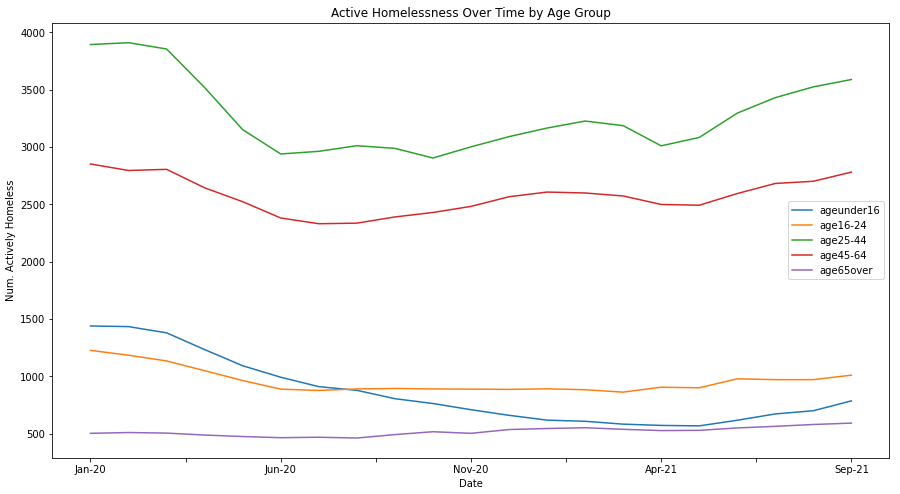

# Homelessness in Toronto
## About us
Authors' name and github name:

- Arujan Srimohan | Arujan619
- Jordan Lam | jordanhklam
- Mitch Nolte | mitchnolte
- Ali Rizvi | AliRizviOTU

## Introduction
Homelessness is a serious issue that affects people all around the world, and in Toronto the issue is especially significant as the city is the centre of the housing crisis in Southern Ontario. This report is an analysis of the Toronto Shelter System Flow data set. The data set was published by the Shelter, Support & Housing Administration, which is a division of Toronto’s municipal government. It can be accessed from https://open.toronto.ca/dataset/toronto-shelter-system-flow/. This data set is about homeless people in Toronto that use city-funded shelter services. It was collected from the Shelter Management Information System (SMIS), which is used by the services to take people into their programs. The downside of this collection method is that it only provides data about people who use city-funded services, so it excludes homeless people who utilize other services and those who do not utilize any services whatsoever. This makes developing an understanding of the entire homeless population of the city impossible with this data set alone. Despite this limitation, we believe it is the most reliable data available about homelessness in Toronto as it was produced by the city’s government.

## Discussion
#### Discussion 1
We were able to resolve multiple findings during our analysis on homelessness in Toronto; some of these findings informed, some reassured, and some surprised. 

It has been a monumental effort of great governments to reduce active homelessness. Having a dataset based on homelessness allowed us to venture right into this topic. As different members researched different areas of this dataset, one was tasked to figure out if active homelessness had improved from 2020 to the present year 2021. The results were quite shocking. 

Taking into account the number of actively homeless in January of 2020 versus January of 2021, the numbers spiked down almost 20%; from the surface this is great news. But what more can our solution tell us? While the numbers dropped with such magnitude, so did it rise in the later months of 2021. Did homelessness really drop? Will the increase in 2021 bring the numbers back to where they were in January of 2020, or perhaps even higher? The data set we worked with was updated until September of 2021, so without adding more to our pool of data, some post-analysis questions, as the ones recently mentioned, can only have weak assumptions as solutions. 

The relatively shocking drop and spike in numbers suggests a possible unprecedented event occurring in those times. Arguably, one of the most significant recent global events was the Covid-19 pandemic. AJMC displays a convenient timeline of Covid-19 on their website (link). In January of 2020, the same time the number of active homelessness started to decline, the World Health Organization (WHO) “announces mysterious Coronavirus-related pneumonia in Wuhan, China” (Staff, 2021). Furthermore, after March 2020, the time when the greatest decline of active homelessness began, is when WHO declared Covid-19 as a pandemic. The relationships between our results and the Covid-19 timeline continues; in 2021, around the time vaccines became streamline, is when active homeless spiked up in numbers.

Covid-19 being such a large possibility for influencing our results, it is difficult to figure out if homelessness is truly being reduced, and if so, by which magnitude. However, if assuming that the pandemic did really cause these sudden spikes to happen, interesting assumptions and insights can then be drawn from the solutions, ones that we never intended to find. One assumption that can be made is that the government believed reducing the number of people on the streets would help reduce the virus from spreading; therefore, a more than usual federal budget was expended to insure places for homeless people to stay.

#### Discussion 2
As we first began to lay out pathways for researching this data set, the first area of interest we delved into were age groups; specifically which ones were the most susceptible to homelessness. The solutions derived from this topic were very informative, they were also however, hollow in nature; meaning the results served as general knowledge that could be used as building blocks for larger and more wholesome ideas/solutions.

The group member that selected this topic to work on produced a line diagram that resembles a rough normal distribution (shown below). Based on the diagram, it can be observed that ages around 25-44 are the most susceptible to homelessness, while under 16 and over 65 are the least susceptible. 

Knowing this information, one could branch out into niche topics, such as the extra care and attention given to the youth and elderly in preventing them from homelessness. What causes the sudden spike in numbers after the age of 24? Why are there sudden drops in numbers after the age of 64?

#### Discussion 3
Canada is renowned for its multiculturalism and kindliness, and it’s government promotes every bit of it. Our data set deals with a diverse range of people, from families and refugees, all the way to single adults. This allows for us to extract very valuable insights in regards to how accurate Canada’s recognition is and could answer questions such as, do we need to improve how help is distributed? Are we doing a sufficient job currently?

Observation: Government’s Hierarchy of Aid Deliverance
Aid deliverance in any field should be given in the rank of who needs it the most. The help-delivery hierarchy of a non-discriminating government should be in align with this concept, while a discriminating country may base it on other factors such as political power, race, culture, religion, etc. An example of a non-discriminatory act that we see in Canada is the practice of triage, where in the field of medicine, anyone who critically needs help will be prioritized over all others.

Considering this, the desired outcomes of question four should also follow a similar pattern. The diagram below lists the solution in the rank of population groups that have the least success in moving into housing to the most (Families [~13.0% success rate], Refugees [~11.5% success rate], Chronic [~6.5% success rate], Youth [~5.0% success rate], Non-refugees [~3.5% success rate], and finally Single Adult [~2.5% success rate]).

[image]

To suggest the perfect hierarchy of these population groups would require studying that goes far beyond the scope of this project; however, a very distinct Canadian stance can readily be affirmed, the non-discriminatory nature of Canada. Refugees are ranked second to successfully move into housing. This helps to demonstrate that Canada values and supports people from all backgrounds; not holding their physical features or beliefs against them.

If one assumes this hierarchy to be in alignment with today's most progressive sense of justice, then a lot can be learned from this solution. An example of branchening from this assumption would be to simply change the perspective of the ordered list from “the most successful in moving into housing” to “most crucially in need of housing”; changing the meaning of the list based on the aforementioned assumption, can open the door to many new insights. 

## Conclusion
Our analysis of the Toronto Shelter System Flow data set has led to many interesting and useful findings about the homeless population of Toronto. Perhaps the most important of which was the way the population is changing. We found that the population decreased significantly from the beginning of 2020, but started to rise once again in the middle of 2021. The most interesting aspect of this finding was the correlation we discovered between changes in the homeless population and significant events related to the COVID-19 pandemic, indicating that the pandemic or factors caused by the pandemic could have a large impact on the homeless population. Another interesting finding was the distribution of the homeless population by age group. We found that the graph of this distribution resembles a rough normal distribution with 25-44 being the age group most susceptible to homelessness. Our final interesting finding was about the success rate of each population group moving to housing. We found that families have the highest success rate, followed closely by refugees. The high success rate of refugees demonstrates the non-discriminatory nature of Canada’s social services and overall culture.

[refinement setcion]

## Acknowledgements
This project was submitted as the final course project for CSCI 2000U “Scientific Data Analysis” during Fall 2021. The authors certify that the work in this repository is original and that all appropriate resources are rightfully cited.

## README
To run and reproduce the results of this report, ensure the attached data set, toronto-shelter-system-flow.csv, is in the same directory as the jupyter notebook.
